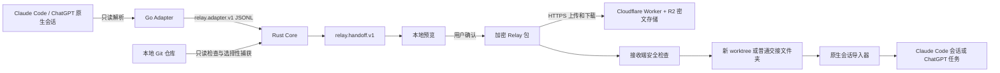

# Relay 架构说明

## 目标和首版范围

Relay 是一个 macOS 桌面应用。发送方从 Claude Code 或 ChatGPT 桌面应用的本机会话中选择可分享内容，并可附带 Git 工作现场。接收方先查看包内内容：有 Git 内容时在新 worktree 中恢复代码；只有会话与说明时创建普通文件夹。随后可把已选择的记录导入为一条新的 Claude Code 会话或 ChatGPT 本机任务。

面向用户的应用名称统一为 ChatGPT。为兼容现有本机数据和系统注册信息，技术实现仍使用 `codex` provider、`~/.codex`、`codex://` 和 bundle ID `com.openai.codex`；Codex CLI 以及 Schema、协议中的 provider 值不改名。

首版有几条固定边界：

- 发送方的 Claude Code 和 ChatGPT 会话目录只读。
- 接收方只有明确点击导入后，才会新增一条原生会话；已有会话文件不会被修改。
- 工具调用和工具结果只是过去发生过的记录，Relay 不会再次执行。
- Relay 不会自动运行安装、构建、测试或项目脚本。
- 含 Git 内容的接收会创建新 worktree；纯会话接收会创建新的普通文件夹。两者都不修改用户正在使用的工作区。
- 链接表示一个不可变快照，不提供多人同时编辑。

## 组件



### React 界面

前端负责展示项目、workspace、会话列表、分享选择页、包预览和接收结果。它通过 Tauri command 调用 Rust，不直接读取 Agent 历史目录，也不直接执行 Git。

前端已有会话、项目、分享选项、加密包、云端上传、接收预览和本机分享记录页面。浏览器开发模式不提供本机会话数据，只显示桌面应用说明；真实 Adapter、Git 和文件操作只在 Tauri 应用中运行。

### Tauri / Rust Core

Rust 是桌面应用的可信边界，职责包括：

- 检查本机 Git、Claude Code、ChatGPT、Codex CLI 和 Adapter 是否可用。
- 启动 Go Adapter，限制运行时间和输出大小，并检查 JSONL 响应。
- 识别仓库、分支、HEAD、staged、unstaged、untracked、submodule、LFS 和正在进行的 Git 操作。
- 把本机绝对路径转换为 `repo://` 逻辑路径。
- 生成和校验 `relay.handoff.v1`。
- 生成包、计算摘要、加密、解密和限制输入大小。
- 导入 Git 数据前先检查，随后在新 worktree 中恢复；没有 Git 数据时只创建普通交接文件夹。
- 创建只读交接材料，并调用独立导入器新增用户选择的 Agent 会话。
- 导入后检查会话文件、索引和 ChatGPT 任务数据库；ChatGPT 任务通过验签后的应用打开。

当前代码已覆盖上述主流程，并用 Rust 测试验证错密钥、密文篡改、危险路径、Git hook/filter、恢复失败后保留现场和纯聊天包恢复。发行版仍需补正式域名、Universal Link、签名、公证和安装测试。

### Go Adapter 和会话导入器

`relay-agent-adapter` 只读扫描 Claude Code 和 ChatGPT 的历史目录，返回会话摘要，或把一个会话解析成通用消息结构。`relay-session-importer` 只在接收者明确选择目标 Agent 后运行，把 `relay.handoff.v1` 中允许分享的记录转换为新的本机会话。

导入器不会复制发送方的原始 JSONL。它只写入可见消息、项目说明和历史工具记录，不包含私有推理、认证信息或厂商内部状态。ChatGPT 使用原生标题事件、任务索引和 SQLite 的自定义名称字段保存带导入时间与短 ID 的唯一标题，标题不会作为聊天消息出现；第一条可见消息仍是发送者允许分享的原始内容或 Relay 的历史记录说明。为了避免 ChatGPT 在接收者继续对话后用第一条项目说明重写标题，SQLite 的 `first_user_message` 使用同一个导入标题作为名称提示，不改变 JSONL 中可见消息的顺序。ChatGPT 导入会新增 JSONL、追加任务索引、通过 SQLite 事务插入任务记录并设为置顶；桌面状态文件存在时也会加入其中的置顶列表。Claude Code 导入会新增项目会话 JSONL，并通过临时文件替换项目会话索引。写入前会备份相关索引、数据库文件和 ChatGPT 桌面状态。

把 Adapter 做成独立 sidecar 有两个原因：原生记录格式变化频繁，可以单独增加解析 fixture；解析失败也不会让桌面进程直接处理不受信任的大文件。进程通信规则见 [adapter-protocol.md](adapter-protocol.md)。

### 分享服务

`cloud/` 中的 Cloudflare Worker 只保存客户端生成的密文和最少状态。R2 保存二进制包，Durable Object 保存到期、撤销和摘要信息。桌面客户端与服务端都把云分享密文限制为 90 MiB；浏览器查看仍使用更低的内存保护上限，超出时提示安装 Relay。两步上传中，公开 PUT 先由 Worker 向 Durable Object 发没有正文的 `authorize` 请求，Worker 再把请求正文直接流式写入 R2，最后向 Durable Object 发没有正文的 `complete` 请求。

`/s/v1/:id` 接收页包含随 Worker 一起构建的浏览器脚本。它读取 URL fragment 中的密钥，只向同源地址请求公开元数据和密文，然后在浏览器内完成 SHA-256、AES-256-GCM、zstd 和包内容检查。页面可以显示完整聊天记录与 `HANDOFF.md`，也可下载原始 `.relaypack`；Git 恢复和原生会话导入仍由桌面应用处理。页面不引用 CDN、外部字体或第三方接口。服务端不会在 HTTP 请求中收到 fragment，但页面代码理论上能够读取它，因此完整链接仍然不是接收者身份认证。具体限制见 [security.md](security.md)。

## 三层数据

Relay 刻意区分三种数据，避免把原生记录原样上传。

1. 原生数据：Claude Code 或 ChatGPT 写下的 JSONL、附件和辅助目录，只在发送方本机读取。
2. Adapter 数据：`relay.adapter.v1`，允许保留本机绝对路径和尚未分类的原始字段，只能存在于本机进程通信中。
3. 分享数据：`relay.handoff.v1`，只允许 `user_visible` 和 `project_owned`，路径使用 `repo://`，资产必须有大小和 SHA-256。

`provider_internal` 和 `private_reasoning` 只能出现在“已省略原因”的计数中，不能作为消息块、未知记录或资产的可分享分类。Rust 不能把 Adapter 的 `raw` 字段直接复制到分享包。

## Relay Handoff v1

正式格式在 [relay-handoff-v1.schema.json](../schemas/relay-handoff-v1.schema.json)。顶层内容如下：

| 字段 | 用途 |
| --- | --- |
| `schema` | 固定为 `relay.handoff.v1` |
| `export` | 完整或精选导出、缺失数量和原因 |
| `source` | 原 Agent、会话标识和 Adapter 版本 |
| `session_state` | 目标、当前状态、下一步、测试和重要文件 |
| `environment` | 发送方系统和工具版本，不保存环境变量 |
| `project` | 项目标识、显示名和 workspace 信息 |
| `conversation` | 消息图、分支、工具记录和未知记录 |
| `assets` | 附件、补丁、bundle 等外部文件的索引 |
| `git` | 本地提交、staged、unstaged、untracked 的捕获状态 |
| `diagnostics` | 丢失信息、兼容问题和阻止导入的原因 |

### 完整度和未知记录

“用户选择了全部内容”不等于“Adapter 理解了全部原生记录”。因此 `export.mode` 和 `completeness.status` 分开表示：

- `mode: full` 表示用户没有主动取消可分享项。
- `mode: selected` 表示用户只选了部分内容。
- `completeness: partial` 表示 Adapter 遇到未知记录、缺少文件或主动省略内容。

Adapter 不认识但确认可分享的事件使用 `kind: unknown` 或 `kind: unsupported`。它们必须带安全摘要、原类型和 `mapping.status`，不能伪装成普通文本，也不能被解释成待执行操作。

### 逻辑路径

包内项目路径统一写成 `repo://` URI：

```text
repo://README.md
repo://src-tauri/src/lib.rs
```

不允许绝对路径、反斜杠、NUL、`.` 或 `..` 路径段。`repo://` 只指新 worktree 的根目录。会话附件若不属于仓库，通过 `asset_id` 引用，不保留发送方的绝对路径。

## `.relaypack` 布局

当前文件格式是单个不可追加的加密对象：

```text
8 bytes   magic: RELAYPK1
12 bytes  AES-GCM nonce
N bytes   AES-256-GCM ciphertext + tag
```

密文中的明文先经过 zstd 压缩。解压后是 `relay.package.v1` JSON envelope，包含 `relay.handoff.v1` 和 payload 列表。Git bundle、patch、untracked 文件和 `HANDOFF.md` 都作为带长度、SHA-256、类型和逻辑路径的 payload 保存，不直接暴露在包外。

Rust validator 还会检查引用关系，例如资产 ID 必须唯一且真实存在，工具结果必须指向已知调用，路径不能包含绝对路径、父目录、符号链接或特殊文件。JSON Schema 只负责其中能静态表达的一部分。

## 发送流程

1. Rust 请求 Adapter 发现会话并读取用户选择的会话，同时记录这一版预览的 `preview_sha256`。
2. Rust 找到仓库根目录，把路径转换为 `repo://`。
3. 分类器移除 provider 内部字段和私有推理，用户再选择消息、工具记录和附件。本地预览列出将要分享、省略和疑似敏感的内容。
4. 用户生成包时，Adapter 重新只读导出会话；Rust 比较 `preview_sha256`。摘要变化时立即停止，要求用户重新查看，不开始 Git 捕获，也不创建包。
5. Rust 检查 Git 状态。merge、rebase 等操作进行中或 dirty submodule 会阻止分享代码。若仓库只有未命中相关路径的 LFS 规则，可以继续；任何实际由 LFS 管理的相关路径都会停止代码分享，不论 pointer 或对象是否在本机。
6. Rust 对最终选中内容再次扫描疑似密钥、连接串等信息。发现命中项时，只返回类型、范围和数量，并要求用户再次明确确认。
7. 确认完成后才生成包和密文。
8. 桌面端用 JSON POST 预留分享，把上传令牌、撤销令牌、包路径、长度和摘要先写成 `pending_upload`，完成文件与目录同步后才 PUT 密文。服务端完成上传后，本机记录改为 `active` 并删除上传令牌。
9. 桌面端默认使用 Relay 内置的 HTTPS 分享服务，核对返回的 origin、路径和分享 ID，再把密钥放进 fragment。用户得到的主要分享入口是 `https://<relay-host>/s/v1/<share-id>#k=<key>`；接收端会从完整链接读取服务 origin，不要求用户另填服务器地址。也可分开发送本地 `.relaypack` 与密钥。厂商网页聊天链接不走这条包协议，不能恢复 Git 现场。

## 接收流程

1. 下载密文到用户选择的 `.relaypack` 路径，核对长度和 SHA-256；若 AEAD 或内容检查失败，立即删除该文件。
2. 展示项目、会话、Git 改动、附件和警告，等待用户确认。
3. 有 Git 内容时，用户选择接收方仓库和新项目的保存位置，Relay 自动生成不会重名的新分支名；纯会话包只选择新文件夹的保存位置。用户随后直接选择导入到 ChatGPT 或 Claude Code，也可只保存文件。
4. 有 Git 内容时导入本地提交并创建新 worktree；纯会话包创建普通文件夹，并在根目录写入只读的 `HANDOFF.md` 和 `handoff.json`，不要求 Git 仓库。这两个文件只用于浏览器阅读、未安装 Relay 或原生会话导入失败时备用。
5. 先检查 staged patch，再检查 unstaged patch，最后写入选中的 untracked 文件。任何一步失败都停止，保留诊断信息。
6. 比较恢复后的 HEAD、index 和 working tree，确保与包内描述一致。
7. Git 恢复会在 worktree 中创建只读的随机 Relay 交接目录，并用精确 ignore 规则避免改变用户看到的 Git 状态；纯会话恢复直接使用新建的普通文件夹。
8. 验证结果会先说明分享包是否包含可导入的聊天或项目说明。只有代码或工具记录时，界面只允许保存文件，不创建空会话。用户选择目标 Agent 后，导入器分配新的会话 ID，检查目标文件、索引和 ChatGPT SQLite 中没有同名记录，再生成会话内容。
9. ChatGPT 会话使用 UUID v7，新增 `~/.codex/sessions/.../rollout-*.jsonl`，追加 `session_index.jsonl`，通过 SQLite 事务新增任务记录并写入置顶状态；在 `.codex-global-state.json` 存在时，也把新任务加入 `pinned-thread-ids`。如果 ChatGPT 尚未建立 `state_5.sqlite`，Relay 会要求用户先打开一次 ChatGPT，不会只写一份无法出现在任务列表中的 JSONL。Claude Code 会话使用新的 UUID，新增项目 JSONL，并更新 `sessions-index.json`。
10. 导入完成后再次检查会话文件、索引、ChatGPT SQLite 记录和置顶状态。任一步失败时，只删除本次创建的文件和记录，并返回备份位置。
11. ChatGPT 路径先通过当前用户的 `~/.codex/ipc/ipc.sock` 发送 `query-cache-invalidate`，要求运行中的 ChatGPT 重新读取本机任务列表；随后用不含任务 ID 的 `codex://threads/new` 枚举 macOS 处理应用，并用 Security.framework 核对 OpenAI 的 bundle ID、Team ID、嵌套代码和所有架构。验签通过后，Relay 只显示 ChatGPT 主窗口，新任务已经置顶，接收者从任务列表顶部打开。Relay 不再自动打开 `codex://threads/<新任务 ID>`，以免 ChatGPT 在恢复任务前显示错误提醒。Claude Code 返回 `claude --resume <新会话 ID>`，不替用户选择终端。

恢复失败时不会强制删除已经创建的 worktree 或分支。错误会返回保留路径、分支 ref 和清理诊断，避免误删恢复期间由其他进程写入的文件。交接目录的 ignore 规则写进 Git common directory 的 `info/exclude`；实现会比较文件身份与内容后再替换和回退，但外部进程不受应用内锁约束，因此仍保留一个很短的并发修改窗口，详见 [security.md](security.md)。

### 分享记录和上传中断

撤销凭据按分享 ID 分文件保存在 Relay 应用数据目录。目录和文件使用仅当前用户可访问的权限，所有操作同时受线程锁和 `flock` 进程锁保护；临时记录可恢复，损坏记录会隔离，macOS 上该目录还会写入并验证 Time Machine 排除属性。

桌面端先用 JSON POST 预留分享。拿到每条分享自己的上传令牌和撤销令牌后，先把完整 `pending_upload` 记录写入临时文件，完成文件与目录同步，再 PUT 密文。Worker 先向 Durable Object 发没有正文的 `authorize` 请求，通过后把密文直接流式写入 R2，再向 Durable Object 发没有正文的 `complete` 请求。服务端状态变为 `ready` 后，桌面端才把本机记录原子改成 `active` 并删除上传令牌。待上传记录可以继续或撤销；继续前会重新核对包路径、长度和 SHA-256。

Worker 默认给预留 900 秒上传期限。首次 PUT 返回 201，相同令牌、长度和摘要的重试返回 200，不同内容返回 409；进入 `ready` 后不会延长最终有效期。未完成的预留以及写入后未完成确认的 R2 对象由 upload deadline 和 Durable Object alarm 清理。

## 兼容策略

- `relay.handoff.v1` 在主版本 1 内只新增可选字段，不改变已有字段含义。
- Adapter 与 Rust 使用独立的 `relay.adapter.v1`，两边启动时先检查协议版本。
- 遇到新原生记录时，Adapter 返回 `unsupported` 和警告；不得悄悄丢弃后仍标记为 `complete`。
- 高版本 Handoff 若包含接收端不认识的必需字段，接收端只能预览，不能恢复代码。

## 后续再做

这些能力不属于当前首版：

- 直接复制发送方原始 JSONL、模型私有推理或厂商隐藏状态。
- 实时多人编辑同一个工作区。
- Windows 和 Linux 桌面应用。
- 自动运行项目命令。
- 自动更新 submodule 或下载 LFS 对象。
- 在没有用户确认的情况下覆盖已有文件。
